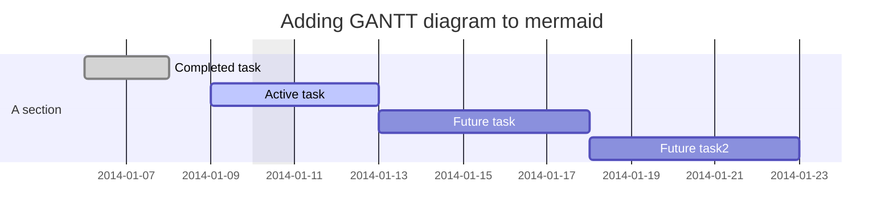
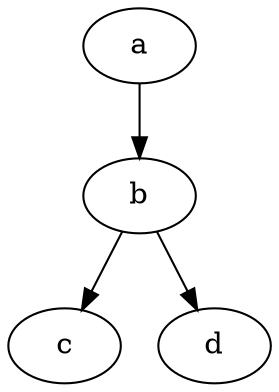

# LearningRepository

## Design


### Wavelength equation

$$\lambda = \frac{v}{f}$$

### Infrared range test

```vega-lite
{
  "data": {"url": "Example.csv"},
  "mark": "line",
  "encoding": {
    "x": {
      "field": "Time",
      "type": "quantitative"
    },
    "y": {
      "field": "Velocity",
      "type": "quantitative"
    }
  }
}
```

```wavedrom
{ signal: [
  { name: "pclk", wave: 'p.......' },
  { name: "Pclk", wave: 'P.......' },
  { name: "nclk", wave: 'n.......' },
  { name: "Nclk", wave: 'N.......' },
  {},
  { name: 'clk0', wave: 'phnlPHNL' },
  { name: 'clk1', wave: 'xhlhLHl.' },
  { name: 'clk2', wave: 'hpHplnLn' },
  { name: 'clk3', wave: 'nhNhplPl' },
  { name: 'clk4', wave: 'xlh.L.Hx' },
]}
```




